# DVC Setup Guide

## Étape 1 : Initialisation de DVC dans le projet

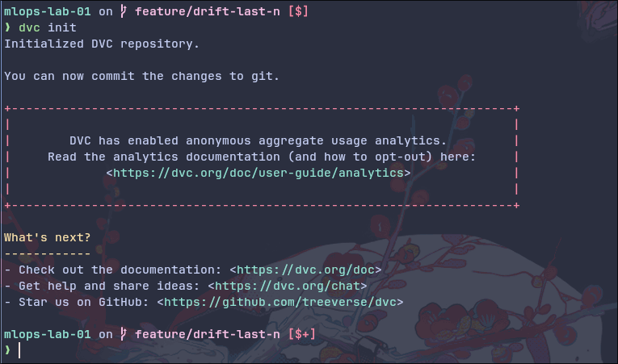

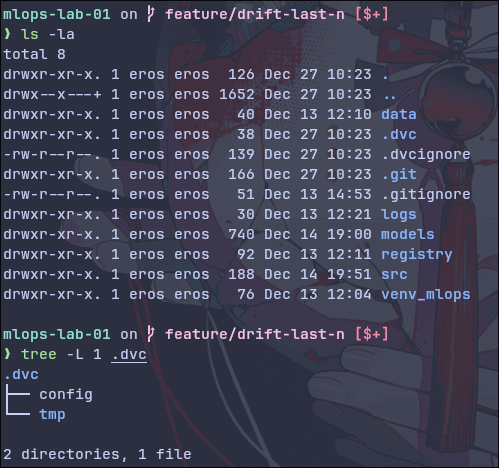

Initialisation de DVC pour permettre le suivi des fichiers volumineux et création des fichiers de configuration .dvc.

---

## Étape 2 : Versionner les données brutes avec DVC

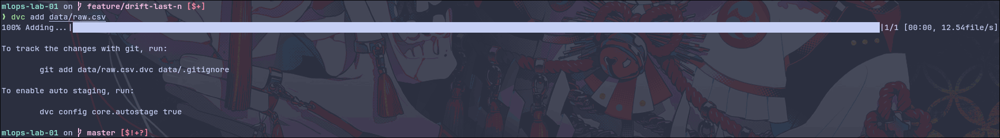

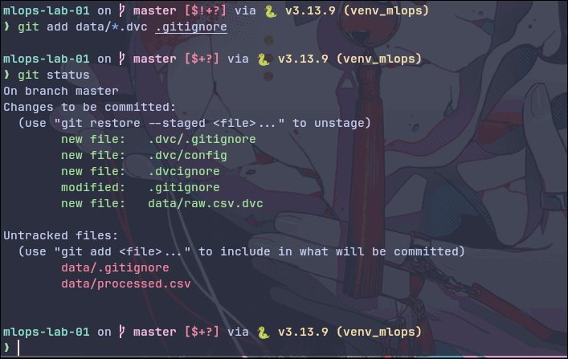

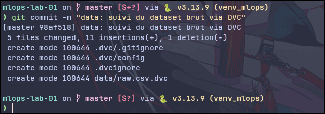

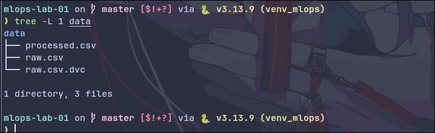

Ajout du dataset `data/raw.csv` au suivi DVC. Le fichier original est remplacé par un pointeur `.dvc` qui est ensuite versionné avec Git.

---

## Étape 3 : Configuration d’un remote DVC

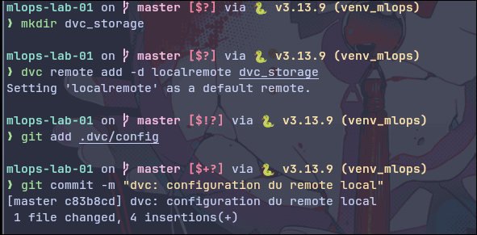

Création et configuration d'un dossier de stockage local (`dvc_storage`) agissant comme remote pour DVC.

---

## Étape 4 : Push des données dans le remote DVC

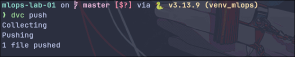

Envoi des fichiers suivis par DVC vers le remote de stockage configuré pour le partage.

---

## Étape 5 : Simulation d’une collaboration : supprimer localement et récupérer depuis DVC

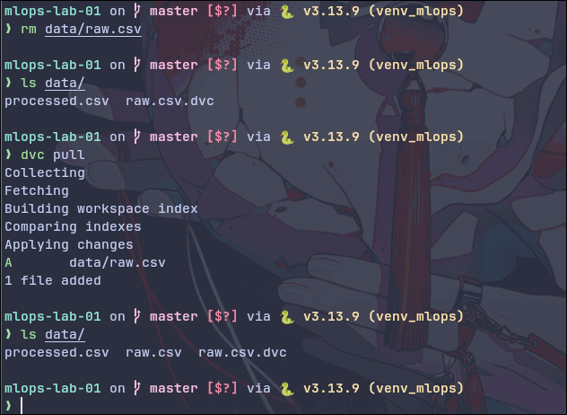

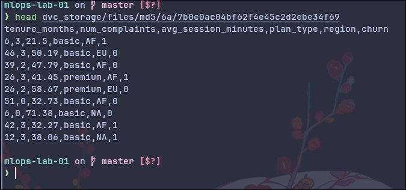

Suppression du fichier local pour simuler une perte ou un nouvel environnement, puis récupération des données depuis le remote via `dvc pull`.

---

## Étape 6 : Création d’un pipeline reproductible dvc.yaml

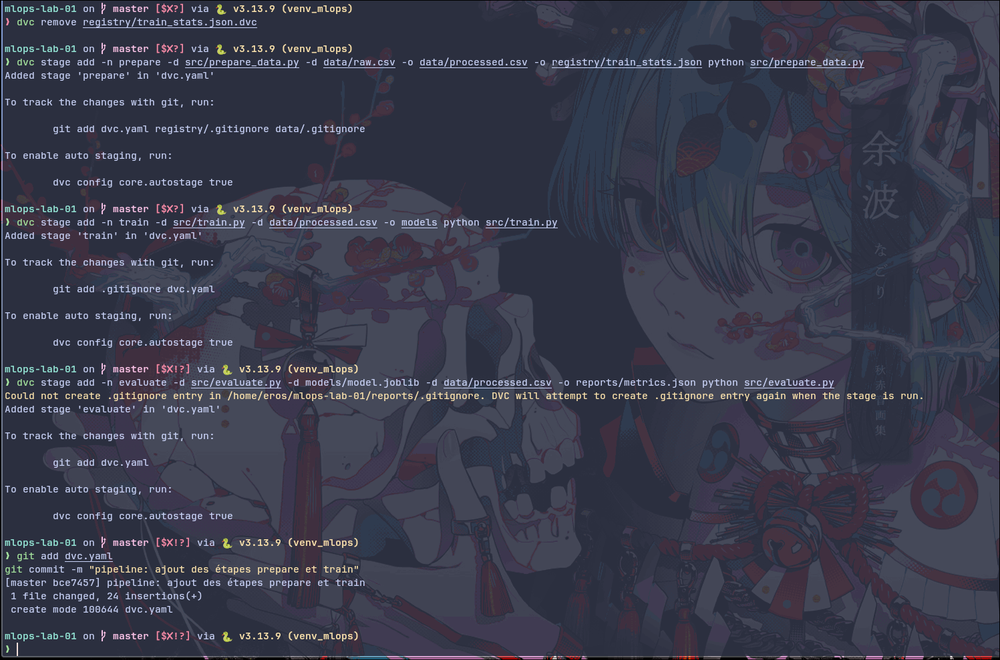

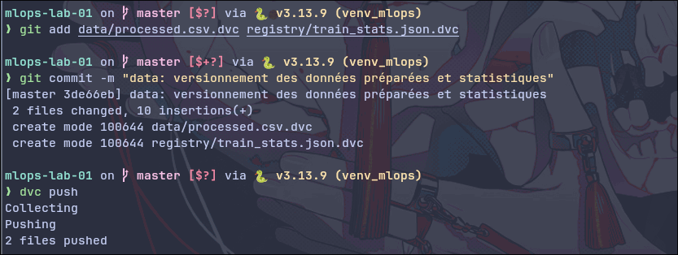

Définition des étapes du pipeline (préparation, entraînement, évaluation) avec leurs dépendances et sorties dans le fichier `dvc.yaml`.

---

## Étape 7 : Reproduire automatiquement tout le pipeline

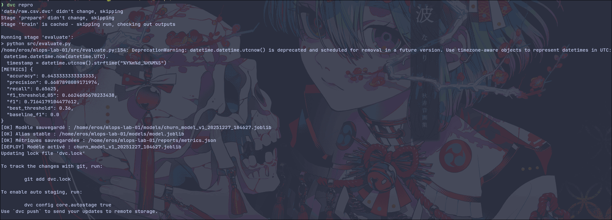

Utilisation de `dvc repro` pour réexécuter automatiquement uniquement les étapes du pipeline affectées par des modifications.
